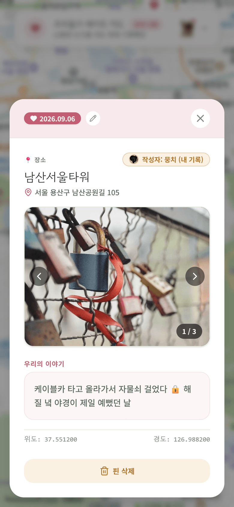
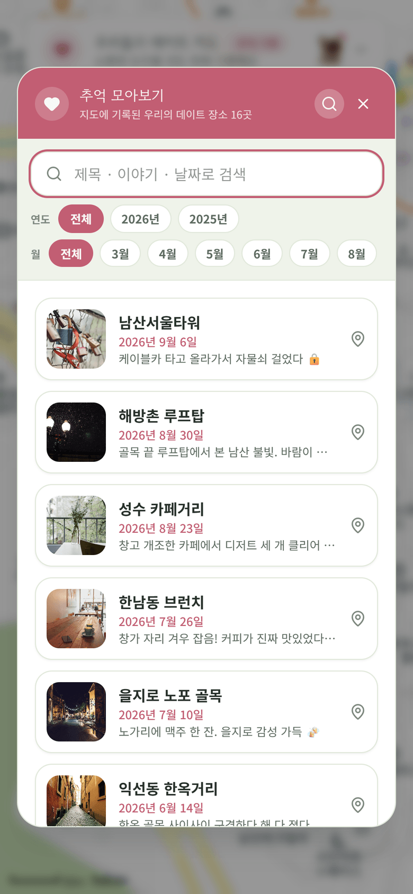
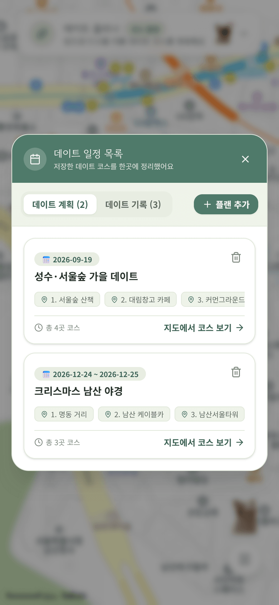
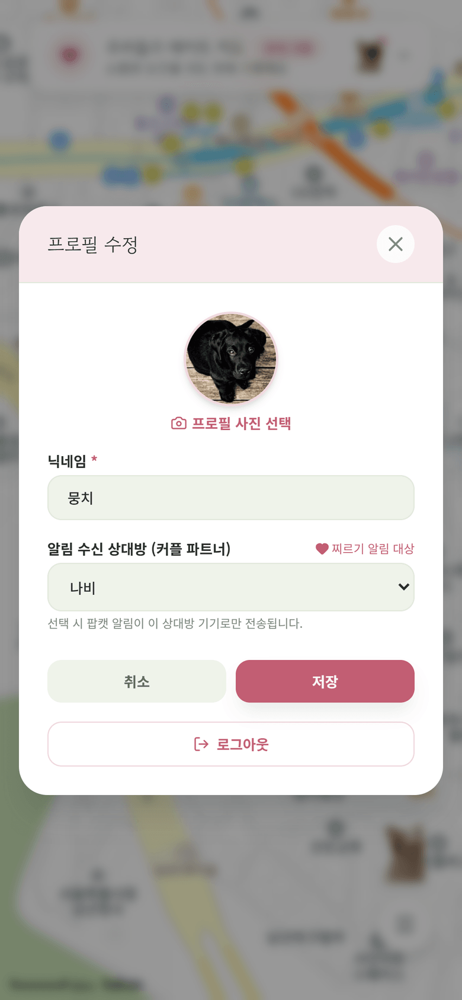
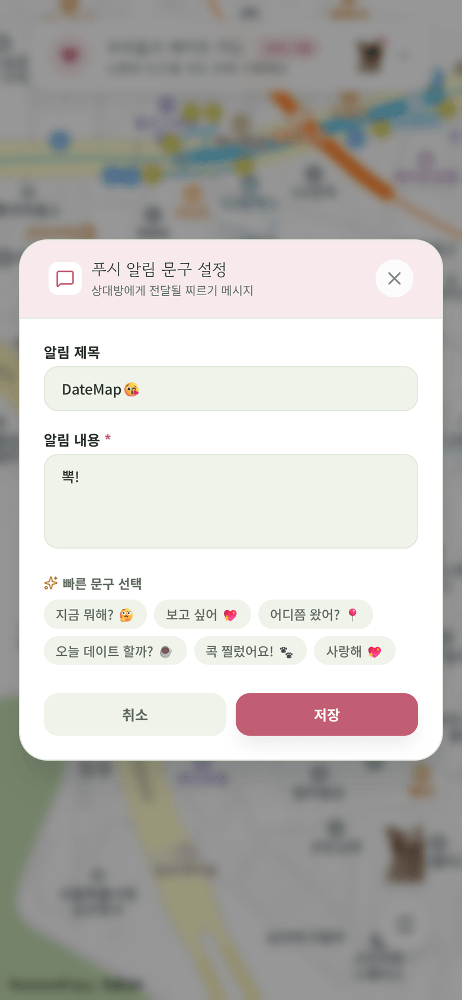
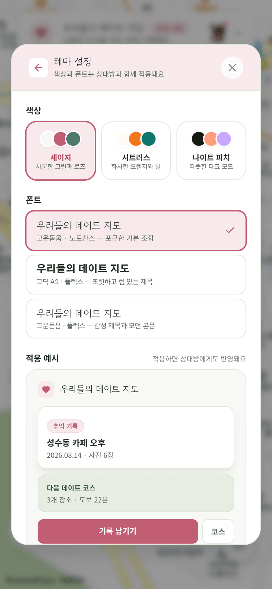
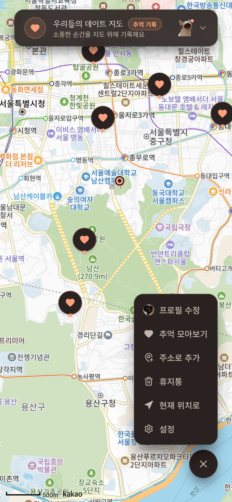

# 💕 Our Date Map — 우리들의 데이트 지도

> 커플이 함께 쓰는 **데이트 기록 · 계획 PWA**.
> 지도 위에 추억을 핀으로 남기고, 다음 데이트 코스를 짜고, 팝캣 버튼으로 서로에게 푸시 알림을 보냅니다.


---

## ✨ 주요 기능

<sub>※ 스크린샷의 장소·사진·프로필은 모두 데모 데이터입니다. (사진: <a href="https://picsum.photos">Lorem Picsum</a> / Unsplash License)</sub>

### 🗺️ 함께 간 곳을 지도 위에 기록해요

<table>
  <tr>
    <td width="200"></td>
    <td width="200"></td>
    <td>

- 지도를 터치하거나 **주소·장소명으로 검색**해 하트 핀을 남겨요
- 장소마다 **사진 최대 10장과 동영상**을 올릴 수 있고, 사진은 업로드 전에 **300KB 이하로 자동 압축**돼요
- 핀을 누르면 요약 팝업 → 상세 시트(사진 캐러셀·이야기 전문) 순서로 열려요
- 누가 남긴 기록인지 **작성자 배지**로 보여줘요
- 실수로 지운 핀은 30일 동안 **휴지통에서 복원**할 수 있어요

</td>
  </tr>
</table>

### 🔍 지난 추억을 한눈에 모아봐요

<table>
  <tr>
    <td width="200"></td>
    <td>

- 지금까지 다녀온 데이트 장소를 **최신순 목록**으로 모아봐요
- **연도·월 칩**으로 추려볼 수 있어요. 실제 기록이 있는 연·월만 칩으로 나와요
- **키워드 검색**은 제목·이야기·날짜를 모두 찾아요. `2026-08-16`, `8월` 같은 날짜 표기도 알아들어요
- 항목을 누르면 지도가 그 장소로 이동하고 상세 보기가 열려요

</td>
  </tr>
</table>

### 📅 다음 데이트 코스를 함께 짜요

<table>
  <tr>
    <td width="200"></td>
    <td width="200"></td>
    <td>

- 날짜(기간)와 제목으로 플랜을 만들면 오늘을 기준으로 **데이트 계획 / 데이트 기록** 탭에 자동으로 나뉘어요
- 경유지는 장소를 검색하거나 지도에 핀을 찍어 추가하고, 순서도 바꿀 수 있어요
- **Kakao Mobility**로 코스 전체 경로선과 총 거리·소요시간을 그려요
- 구간마다 이동수단을 **대중교통 / 자동차** 중에서 골라요. 대중교통은 **ODsay**로 도보 포함 최단 경로의 노선·소요시간을, 자동차는 최단 거리 경로를 보여줘요
- 계산한 경로는 플랜에 함께 저장돼서, 다시 열 때는 **API를 다시 부르지 않고** 바로 그려요

</td>
  </tr>
</table>

### 💑 상대방과 커플로 연결해요

<table>
  <tr>
    <td width="200"></td>
    <td>

- **카카오 로그인** 한 번으로 시작해요. 닉네임과 프로필 사진만 받고 이메일은 요청하지 않아요
- 프로필에서 상대방을 **커플 파트너로 지정**하면 두 사람이 하나의 커플로 묶여요
- 연결되면 팝캣 알림이 **상대방 기기로만** 가고, 테마 같은 설정을 **둘이 함께** 써요

</td>
  </tr>
</table>

### 🐱 팝캣으로 상대방을 콕 찔러요

<table>
  <tr>
    <td width="200"></td>
    <td width="200"></td>
    <td>

- 지도 위 **팝캣 버튼**을 누르면 팝캣이 입을 벌리면서 상대방 폰으로 **바로 푸시 알림**을 보내요 (연타 방지 쿨다운)
- 버튼을 **더블클릭**하면 알림 문구를 바꿀 수 있고, "보고 싶어" 같은 빠른 문구도 준비돼 있어요
- 앱을 닫아 둬도 **서비스 워커**가 백그라운드에서 알림을 받아요
- 주고받은 알림은 DB에 이력으로 남아요

</td>
  </tr>
</table>

### 🎨 테마를 바꾸면 상대방에게도 적용돼요

<table>
  <tr>
    <td width="200"></td>
    <td width="200"></td>
    <td>

- 색상 3종(세이지·시트러스·나이트 피치)과 폰트 3종을 따로 골라요
- 미리보기 카드로 먼저 확인하고, **적용하기**를 눌러야 실제로 바뀌어요
- 커플로 연결돼 있으면 테마가 **커플 공용 설정**으로 저장돼서, **상대방이 앱을 열면 같은 테마로 맞춰져요**
- 화면이 그려지기 전에 저장된 테마를 먼저 적용해 깜빡임이 없고, PWA 상단바 색도 테마를 따라가요

</td>
  </tr>
</table>

---

## 🛠️ 기술 스택

| 분류 | 기술 |
| --- | --- |
| Frontend | Next.js 16 (App Router) · React 19 · TypeScript · Tailwind CSS v4 · Lucide React |
| Backend / DB | Supabase (PostgreSQL · Auth · Storage · RLS) · Next.js Route Handlers |
| 지도 · 경로 | Kakao Maps JavaScript SDK · Kakao Mobility Directions API · ODsay 대중교통 API |
| PWA / Push | Web App Manifest (standalone) · Service Worker · Web Push (VAPID) |
| 유틸리티 | browser-image-compression (클라이언트 이미지 압축) |

---

## 🏗️ 아키텍처 & 엔지니어링 포인트

### 1. API 키 보호 프록시 패턴
외부 REST API(Kakao Mobility, ODsay)는 클라이언트에서 직접 호출하지 않고 **Next.js Route Handler를 프록시로 경유**합니다. 비밀 키는 서버 환경변수로만 접근해 클라이언트 번들에 노출되지 않습니다.

```
Client → /api/directions → Kakao Mobility API   (KAKAO_REST_API_KEY, 서버 전용)
Client → /api/transit    → ODsay API            (ODSAY_API_KEY, 서버 전용)
Client → /api/push/send  → Web Push 발송         (VAPID_PRIVATE_KEY, 서버 전용)
```

### 2. API 쿼터 보호 다층 캐싱
ODsay 일 1,000회 등 외부 API 쿼터를 보호하기 위해 경로 데이터를 3단계로 캐싱합니다.

1. **인메모리 캐시** — 동일 구간(좌표 키) 중복 호출 방지 (`useTransitRoute`)
2. **localStorage** — 새로고침 간 플랜/경로 보존
3. **DB 영구 저장** — 계산된 경로 전체(`path` Polyline 좌표, 구간별 대중교통 정보)를 `date_plans.route_summary`(JSONB)에 저장, 코스 불러오기 시 API 재호출 없이 즉시 복원 렌더링. 장소 추가/삭제/순서 변경 시에만 재탐색

### 3. 데이터 무결성 설계
- **소프트 삭제**: 핀 삭제 시 원본을 `deleted_date_spots`에 JSONB로 아카이빙 후 `deleted_at` 마킹 — **DB 트리거**가 동기화를 보장하고, 복원 API 제공
- **정규화**: 작성자 메타데이터를 `date_spots`의 하드코딩 컬럼에서 `public.profiles` 테이블로 분리, FK 기반 관계형 JOIN(`select('*, profiles(...)')`)으로 조회
- **RLS**: 전 테이블 Row Level Security 정책 적용, 마이그레이션 17개로 스키마 이력 관리

### 4. 모바일 퍼스트 PWA
- `display: standalone` 매니페스트 + 풀스크린 무스크롤 지도 레이아웃으로 네이티브 앱 수준의 UX
- 서비스 워커가 백그라운드 푸시 수신·클릭 포커싱 처리
- 핀치 줌 방지, 터치 제스처(더블클릭·롱프레스), 햅틱 피드백 등 모바일 인터랙션 디테일

---

## 🗄️ 데이터베이스 구성

| 테이블 | 역할 |
| --- | --- |
| `date_spots` | 데이트 장소 핀 (사진 배열, 메모, 좌표, 작성자 FK, 소프트 삭제) |
| `deleted_date_spots` | 삭제 핀 휴지통 (원본 JSONB 아카이브, 트리거 동기화) |
| `date_plans` | 미래 데이트 플랜 (기간, 코스 핀 목록, `route_summary` JSONB 경로 캐시) |
| `profiles` | 사용자 프로필 (닉네임, 아바타, 파트너 지정 `partner_id`) |
| `push_subscriptions` | 기기별 Web Push 구독 정보 |
| `push_messages` | 푸시 발송 이력 (발신/수신자, 제목/본문, 발송 시각) |

Storage 버킷: `date-photos`(추억 사진), `avatars`(프로필 사진)

---

## 📂 프로젝트 구조

```
src/
├── app/
│   ├── api/
│   │   ├── directions/route.ts   # Kakao Mobility 경유지 경로 프록시
│   │   ├── transit/route.ts      # ODsay 대중교통 경로 프록시
│   │   └── push/send/route.ts    # Web Push 발송 + 이력 기록
│   ├── auth/callback/route.ts    # Kakao OAuth 콜백 (세션 교환)
│   └── page.tsx                  # 메인 지도 화면
├── components/
│   ├── common/                   # Header, Toast
│   ├── map/                      # MapContainer
│   └── modal/                    # 스팟/플랜/프로필/푸시 모달 & 바텀 시트
├── hooks/                        # useKakaoMap, useDateSpots, useFuturePlanner,
│                                 # useTransitRoute, useWebPush, useAuth ...
├── lib/                          # supabase 클라이언트, 이미지 압축 업로드
└── types/                        # 도메인 타입 (spot, planner, transit, supabase)
supabase/
├── migrations/                   # 스키마 마이그레이션 17개
└── schema.sql                    # 통합 참조 스키마
public/
├── manifest.json                 # PWA 매니페스트 (standalone)
└── sw.js                         # 서비스 워커 (백그라운드 푸시)
```

---

## 🚀 시작하기

### 1. 환경변수 설정

`.env.local` 파일을 생성합니다.

```bash
# Supabase
NEXT_PUBLIC_SUPABASE_URL=<Supabase 프로젝트 URL>
NEXT_PUBLIC_SUPABASE_ANON_KEY=<Supabase anon key>

# Kakao (클라이언트: 지도 SDK / 서버 전용: Mobility REST)
NEXT_PUBLIC_KAKAO_MAP_KEY=<Kakao JavaScript 키>
KAKAO_REST_API_KEY=<Kakao REST API 키>

# ODsay 대중교통 (서버 전용)
ODSAY_API_KEY=<ODsay API 키>

# Web Push VAPID (npx web-push generate-vapid-keys)
NEXT_PUBLIC_VAPID_PUBLIC_KEY=<VAPID public key>
VAPID_PRIVATE_KEY=<VAPID private key>
VAPID_SUBJECT=mailto:<연락 이메일>
```

### 2. 실행

```bash
npm install
npm run dev        # http://localhost:3000
```

### 3. 데이터베이스 (Supabase CLI)

```bash
npx supabase db push                                          # 마이그레이션 적용
npx supabase gen types typescript --linked > src/types/supabase.ts   # 타입 생성
```

---

## 📚 문서

- [CHANGELOG.md](CHANGELOG.md) — 버전별 변경 이력 (Keep a Changelog / SemVer)
- [TASKS.md](TASKS.md) — 작업 현황 인덱스
- [docs/conventions.md](docs/conventions.md) — Git 커밋 · 브랜치 · PR 컨벤션 (Gitmoji)
