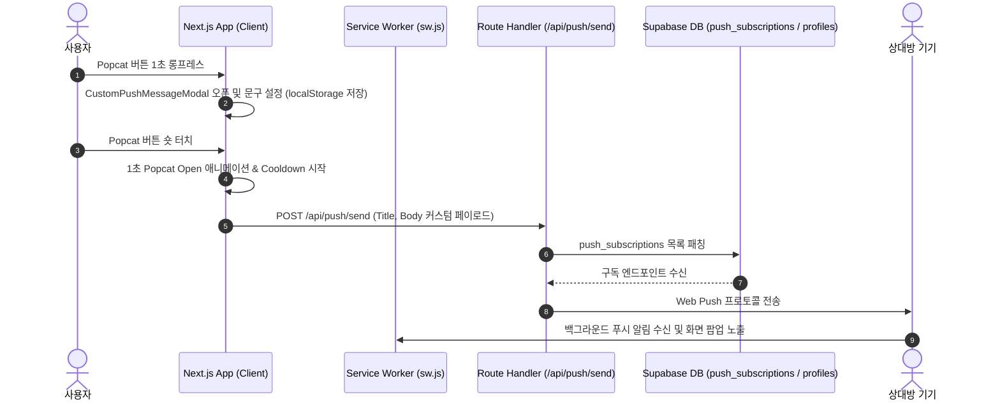

# [Task 09] Web Push 알림, Popcat 인터랙션, 프로필 분리 & 소프트 삭제 휴지통 파이프라인

## 📌 작업 개요
- **버전:** `v0.5.0`
- **구현일:** 2026-07-24
- **주요 목적:** 커플 간 실시간 PWA Web Push 알림 전송 시스템, Popcat 커스텀 이미지 인터랙션 & 1초 롱프레스 알림 문구 설정, 작성자 메타데이터 `profiles` 테이블 완전 분리, 프로필 수정 모달 및 삭제 핀 휴지통(`deleted_date_spots`) 소프트 삭제 메커니즘을 구축했습니다.

---

## 🛠️ 세부 요구사항 & 구현 완료 내역

### 1. PWA Web Push Notification 시스템 구축
- **VAPID 키 및 서비스 워커 연동 (`public/sw.js`)**:
  - Web Push API 기반 서비스 워커 등록, Push Subscription 발급 및 Supabase `push_subscriptions` DB 테이블 저장/삭제 처리.
  - 백그라운드 푸시 알림 수신 및 클릭 시 앱 화면 포커싱 처리 (`sw.js`).
- **Next.js Push Route Handler (`src/app/api/push/send/route.ts`)**:
  - `web-push` 라이브러리를 활용하여 DB에 등록된 활성 알림 기기(`push_subscriptions`)에 실시간 Web Push 알림 발송.
  - 만료되거나 유효하지 않은 푸시 엔드포인트(404, 410 상태코드) 자동 정리 및 예외 핸들링.
- **Push 연동 커스텀 훅 (`src/hooks/useWebPush.ts`)**:
  - 브라우저 알림 권한 요청, ON/OFF 구독 상태 `localStorage` (`our_date_map_push_enabled`) 동기화 및 즉시 전송 헬퍼 함수 (`sendInstantPushNotification`) 연동.

---

### 2. Popcat 알림 버튼 & 1초 전이 애니메이션
- **투명 이미지 버튼 적용 ([Header.tsx](file:///c:/dev/our-date-map/src/components/common/Header.tsx), [MapContainer.tsx](file:///c:/dev/our-date-map/src/components/map/MapContainer.tsx))**:
  - 헤더 프로필 영역(`[로그아웃]` 좌측) 및 지도 우측 하단 알림 버튼을 Transparent Popcat 이미지(`/icons/popcat_close.png`)로 변경.
  - Borderless, background-transparent (`bg-transparent border-none p-0 outline-none active:scale-90`) 스타일 적용 및 모바일 드래그 방지 (`select-none pointer-events-none`).
- **1초 전이 애니메이션 & 클릭 쿨다운 (Rate Limiting)**:
  - 알림 전송 버튼 클릭 시 즉시 상대방에게 푸시 알림을 발송하고, 1초간 mouth-open 상태(`/icons/popcat_open.png`)로 자동 전이 후 원복.
  - `isCooldown` 연타 방지 로직을 연동하여 1초 내 중복 클릭을 차단함으로써 푸시 알림 남발 방지.

---

### 3. 1초 롱프레스(Long-Press) 제스처 & 커스텀 알림 문구 모달
- **1초 롱프레스 제스처 연동**:
  - Popcat 푸시 버튼에 Mouse/Touch 1초 롱프레스 이벤트 핸들러 연동.
  - 1초 미만 숏 터치: 푸시 ON/OFF 토글 또는 즉시 알림 전송.
  - 1초 이상 길게 누름: 햅틱 진동 피드백(`vibrate(50)`)과 함께 커스텀 문구 설정 모달 오픈.
- **커스텀 푸시 문구 설정 모달 ([CustomPushMessageModal.tsx](file:///c:/dev/our-date-map/src/components/modal/CustomPushMessageModal.tsx))**:
  - 알림 제목 및 본문 입력, 빠른 프리셋 칩("지금 뭐해? 🤔", "보고 싶어 💖", "어디쯤 왔어? 📍", "오늘 데이트 할까? ☕", "콕 찔렀어요! 🐾", "사랑해 💖") 클릭 입력 지원.
  - 기본 디폴트 문구: 제목 `"DateMap😘"`, 본문 `"뽁!"`. 설정 문구를 `localStorage` (`our_date_map_custom_push_message`)에 영구 저장하고, 푸시 전송 시 dynamic payload로 대입하여 상대방 기기 상단 알림 팝업에 노출.

---

### 4. 작성자 메타데이터 `profiles` 테이블 분리 & 프로필 수정 모달
- **`public.profiles` DB 마이그레이션 (`20260723233625_decouple_creator_data_to_profiles.sql`)**:
  - `date_spots` 테이블 내 하드코딩된 작성자 컬럼들을 제거하고, `auth.users(id)`와 1:1 매핑되는 `public.profiles` 테이블 신설.
  - 신규 유저 가입 시 프로필 자동 생성 DB 트리거(`on_auth_user_created`) 구축 및 `created_by REFERENCES public.profiles(id)` 외래키(FK) 기반 dynamic relational JOIN 구문으로 리팩토링.
- **프로필 수정 모달 ([ProfileEditModal.tsx](file:///c:/dev/our-date-map/src/components/modal/ProfileEditModal.tsx))**:
  - 헤더 드롭다운 유저 카드 터치 시 닉네임 및 프로필 사진 변경 모달 제공.
  - `browser-image-compression`으로 사진을 300KB 이하로 압축 후 Supabase Storage `avatars` 퍼블릭 버킷에 업로드하고 `public.profiles` DB 동기화.

---

### 5. 삭제된 데이트 핀 휴지통 테이블 (`deleted_date_spots`) & 소프트 삭제 메커니즘
- **휴지통 DDL 마이그레이션 (`20260724000135_create_deleted_date_spots_table.sql`)**:
  - 핀 삭제 시 하드 삭제를 방지하고 복원할 수 있도록 `deleted_date_spots` 휴지통 전용 테이블 신설 및 DB 트리거(`on_date_spot_soft_deleted`, `20260724000701_sync_soft_deleted_spots_to_trash_table.sql`) 구축.
  - 핀 삭제 요청 시 스팟 전체 데이터를 JSONB로 휴지통에 보존한 뒤 `date_spots` 내 `deleted_at = NOW()` 소프트 삭제 처리.
  - 핀 원상 복원 헬퍼 메서드 (`restoreDateSpot`) 연동.

---

## 🏗️ 기술 구조 및 데이터 흐름

---

## 📋 검증 체크리스트 (Verification Checklist)

- [x] **TypeScript 정적 타입 검사**: `npx tsc --noEmit` 실행 시 0 에러 통과.
- [x] **Popcat 알림 버튼 UI**: Transparent Popcat 이미지 적용, 1초간 입 벌리는 애니메이션 및 1초 쿨다운 정상 작동.
- [x] **1초 롱프레스 모달 제스처**: 1초 이상 누를 시 진동 피드백과 함께 문구 설정 모달이 열리고, 숏 터치 시에는 알림이 바로 발송됨.
- [x] **커스텀 페이로드 전달**: 입력한 문구가 `localStorage`에 보존되며, 푸시 발송 시 상대방 기기 백그라운드 팝업에 올바르게 노출됨.
- [x] **프로필 수정 & DB 분리**: 닉네임/사진 수정 시 300KB 압축 후 Supabase `avatars` 버킷 및 `public.profiles` DB에 실시간 동기화됨.
- [x] **소프트 삭제 휴지통 연동**: 핀 삭제 시 `deleted_date_spots` 테이블에 아카이빙되며, `date_spots` 내 `deleted_at` 처리됨.
