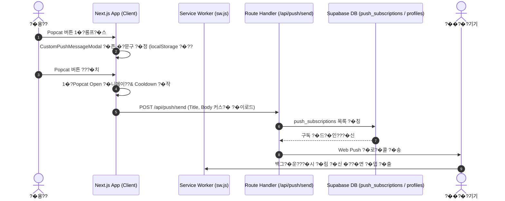

# [Task 09] Web Push ?�림, Popcat ?�터?�션, ?�로??분리 & ?�프????�� ?��????�이?�라??

## ?�� ?�업 개요
- **버전:** `v0.5.0`
- **구현??** 2026-07-24
- **주요 목적:** 커플 �??�시�?PWA Web Push ?�림 ?�송 ?�스?? Popcat 커스?� ?��?지 ?�터?�션 & 1�?롱프?�스 ?�림 문구 ?�정, ?�성??메�??�이??`profiles` ?�이�??�전 분리, ?�로???�정 모달 �???�� ?� ?��???`deleted_date_spots`) ?�프????�� 메커?�즘??구축?�습?�다.

---

## ?���??��? ?�구?�항 & 구현 ?�료 ?�역

### 1. PWA Web Push Notification ?�스??구축
- **VAPID ??�??�비???�커 ?�동 (`public/sw.js`)**:
  - Web Push API 기반 ?�비???�커 ?�록, Push Subscription 발급 �?Supabase `push_subscriptions` DB ?�이�??�????�� 처리.
  - 백그?�운???�시 ?�림 ?�신 �??�릭 ?????�면 ?�커??처리 (`sw.js`).
- **Next.js Push Route Handler (`src/app/api/push/send/route.ts`)**:
  - `web-push` ?�이브러리�? ?�용?�여 DB???�록???�성 ?�림 기기(`push_subscriptions`)???�시�?Web Push ?�림 발송.
  - 만료?�거???�효?��? ?��? ?�시 ?�드?�인??404, 410 ?�태코드) ?�동 ?�리 �??�외 ?�들�?
- **Push ?�동 커스?� ??(`src/hooks/useWebPush.ts`)**:
  - 브라?��? ?�림 권한 ?�청, ON/OFF 구독 ?�태 `localStorage` (`our_date_map_push_enabled`) ?�기??�?즉시 ?�송 ?�퍼 ?�수 (`sendInstantPushNotification`) ?�동.

---

### 2. Popcat ?�림 버튼 & 1�??�이 ?�니메이??
- **?�명 ?��?지 버튼 ?�용 ([Header.tsx](file:///C:/Users/aica_/Desktop/projects/our-date-map/src/components/common/Header.tsx), [MapContainer.tsx](file:///C:/Users/aica_/Desktop/projects/our-date-map/src/components/map/MapContainer.tsx))**:
  - ?�더 ?�로???�역(`[로그?�웃]` 좌측) �?지???�측 ?�단 ?�림 버튼??Transparent Popcat ?��?지(`/icons/popcat_close.png`)�?변�?
  - Borderless, background-transparent (`bg-transparent border-none p-0 outline-none active:scale-90`) ?��????�용 �?모바???�래�?방�? (`select-none pointer-events-none`).
- **1�??�이 ?�니메이??& ?�릭 쿨다??(Rate Limiting)**:
  - ?�림 ?�송 버튼 ?�릭 ??즉시 ?��?방에�??�시 ?�림??발송?�고, 1초간 mouth-open ?�태(`/icons/popcat_open.png`)�??�동 ?�이 ???�복.
  - `isCooldown` ?��? 방�? 로직???�동?�여 1�???중복 ?�릭??차단?�으로써 ?�시 ?�림 ?�발 방�?.

---

### 3. 1�?롱프?�스(Long-Press) ?�스�?& 커스?� ?�림 문구 모달
- **1�?롱프?�스 ?�스�??�동**:
  - Popcat ?�시 버튼??Mouse/Touch 1�?롱프?�스 ?�벤???�들???�동.
  - 1�?미만 ???�치: ?�시 ON/OFF ?��? ?�는 즉시 ?�림 ?�송.
  - 1�??�상 길게 ?�름: ?�틱 진동 ?�드�?`vibrate(50)`)�??�께 커스?� 문구 ?�정 모달 ?�픈.
- **커스?� ?�시 문구 ?�정 모달 ([CustomPushMessageModal.tsx](file:///C:/Users/aica_/Desktop/projects/our-date-map/src/components/modal/CustomPushMessageModal.tsx))**:
  - ?�림 ?�목 �?본문 ?�력, 빠른 ?�리??�?"지�?뭐해? ?��", "보고 ?�어 ?��", "?�디�??�어? ?��", "?�늘 ?�이???�까? ??, "�?찔�??�요! ?��", "?�랑???��") ?�릭 ?�력 지??
  - 기본 ?�폴??문구: ?�목 `"DateMap?��"`, 본문 `"�?"`. ?�정 문구�?`localStorage` (`our_date_map_custom_push_message`)???�구 ?�?�하�? ?�시 ?�송 ??dynamic payload�??�?�하???��?�?기기 ?�단 ?�림 ?�업???�출.

---

### 4. ?�성??메�??�이??`profiles` ?�이�?분리 & ?�로???�정 모달
- **`public.profiles` DB 마이그레?�션 (`20260723233625_decouple_creator_data_to_profiles.sql`)**:
  - `date_spots` ?�이�????�드코딩???�성??컬럼?�을 ?�거?�고, `auth.users(id)`?� 1:1 매핑?�는 `public.profiles` ?�이�??�설.
  - ?�규 ?��? 가?????�로???�동 ?�성 DB ?�리�?`on_auth_user_created`) 구축 �?`created_by REFERENCES public.profiles(id)` ?�래??FK) 기반 dynamic relational JOIN 구문?�로 리팩?�링.
- **?�로???�정 모달 & ?�트???�택 기능 ([ProfileEditModal.tsx](file:///C:/Users/aica_/Desktop/projects/our-date-map/src/components/modal/ProfileEditModal.tsx))**:
  - ?�더 ?�롭?�운 ?��? 카드 ?�치 ???�네?? ?�로???�진 �??�림 ?�신 ?��?�?커플 ?�트?? ?�택 기능 ?�공.
  - `public.profiles` ?�이블에 `partner_id` 컬럼 마이그레?�션 (`20260724013000_add_partner_id_to_profiles.sql`) �?`browser-image-compression`?�로 ?�진??300KB ?�하�??�축 ??Supabase Storage `avatars` ?�블�?버킷???�로?�하??`public.profiles` DB ?�기??
  - ?�시 ?�림 ?�송 ??지?�된 ?�트??`targetUserId`) 기기로만 조�? 발송 처리.

---

### 5. ??��???�이???� ?��????�이�?(`deleted_date_spots`) & ?�프????�� 메커?�즘
- **?��???DDL 마이그레?�션 (`20260724000135_create_deleted_date_spots_table.sql`)**:
  - ?� ??�� ???�드 ??���?방�??�고 복원?????�도�?`deleted_date_spots` ?��????�용 ?�이�??�설 �?DB ?�리�?`on_date_spot_soft_deleted`, `20260724000701_sync_soft_deleted_spots_to_trash_table.sql`) 구축.
  - ?� ??�� ?�청 ???�팟 ?�체 ?�이?��? JSONB�??��??�에 보존????`date_spots` ??`deleted_at = NOW()` ?�프????�� 처리.
  - ?� ?�상 복원 ?�퍼 메서??(`restoreDateSpot`) ?�동.

---

## ?���?기술 구조 �??�이???�름

```mermaid
sequenceDiagram
    autonumber
    actor User as ?�용??
    participant App as Next.js App (Client)
    participant SW as Service Worker (sw.js)
    participant API as Route Handler (/api/push/send)
    participant DB as Supabase DB (push_subscriptions / profiles)
    actor Partner as ?��?�?기기

    User->>App: Popcat 버튼 1�?롱프?�스
    App->>App: CustomPushMessageModal ?�픈 �?문구 ?�정 (localStorage ?�??
    User->>App: Popcat 버튼 ???�치
    App->>App: 1�?Popcat Open ?�니메이??& Cooldown ?�작
    App->>API: POST /api/push/send (Title, Body 커스?� ?�이로드)
    API->>DB: push_subscriptions 목록 ?�칭
    DB-->>API: 구독 ?�드?�인???�신
    API->>Partner: Web Push ?�로?�콜 ?�송
    Partner->>SW: 백그?�운???�시 ?�림 ?�신 �??�면 ?�업 ?�출
```

---

## ?�� 검�?체크리스??(Verification Checklist)

- [x] **TypeScript ?�적 ?�??검??*: `npx tsc --noEmit` ?�행 ??0 ?�러 ?�과.
- [x] **Popcat ?�림 버튼 UI**: Transparent Popcat ?��?지 ?�용, 1초간 ??벌리???�니메이??�?1�?쿨다???�상 ?�동.
- [x] **1�?롱프?�스 모달 ?�스�?*: 1�??�상 ?��? ??진동 ?�드백과 ?�께 문구 ?�정 모달???�리�? ???�치 ?�에???�림??바로 발송??
- [x] **커스?� ?�이로드 ?�달**: ?�력??문구가 `localStorage`??보존?�며, ?�시 발송 ???��?�?기기 백그?�운???�업???�바르게 ?�출??
- [x] **?�로???�정 & DB 분리**: ?�네???�진 ?�정 ??300KB ?�축 ??Supabase `avatars` 버킷 �?`public.profiles` DB???�시�??�기?�됨.
- [x] **?�프????�� ?��????�동**: ?� ??�� ??`deleted_date_spots` ?�이블에 ?�카?�빙?�며, `date_spots` ??`deleted_at` 처리??

